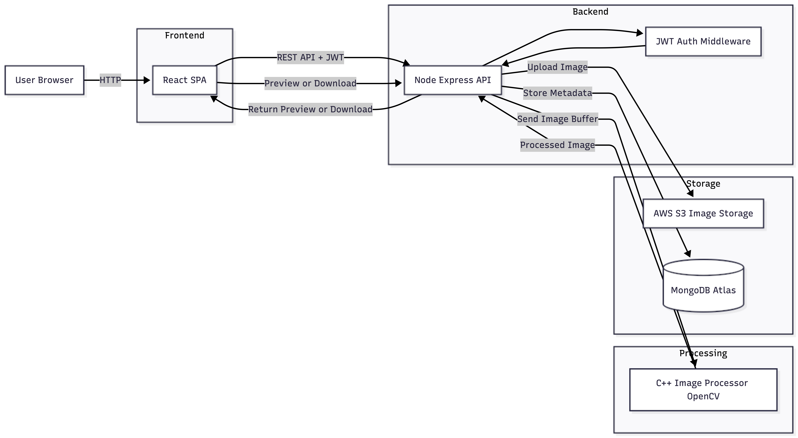

# Emage – Distributed Image Processing Platform

Emage is a full-stack, cloud-deployed image processing platform that allows authenticated users to upload images, 
apply filters using a high-performance C++ (OpenCV) service, and manage their processed images securely.

## Tech Stack

Frontend:
- React
- Axios
- Responsive UI

Backend:
- Node.js
- Express
- JWT Authentication

Image Processing:
- C++
- OpenCV

Database & Storage:
- MongoDB Atlas
- AWS S3

Infrastructure & DevOps:
- Docker
- Render (Deployment)
- GitHub Actions (Cron-based keep-alive)

## Features

- User authentication with JWT (login & register)
- Secure, user-scoped image access
- Upload images and apply filters (grayscale, blur, invert, etc.)
- High-performance image processing using a C++ OpenCV microservice
- Preview, download, and delete processed images
- Cloud-based persistent storage using AWS S3
- Fully dockerized and deployed microservices

## Architecture Overview

Emage follows a microservices-based architecture:

1. **React Frontend**
   - Handles UI, authentication, and user interactions
   - Communicates with backend APIs

2. **Node.js Backend (API Gateway)**
   - Handles authentication, authorization, and business logic
   - Orchestrates communication between frontend, C++ service, MongoDB, and S3

3. **C++ Image Processing Service**
   - Uses OpenCV for CPU-intensive image processing
   - Exposed as an HTTP service
   - Stateless and independently deployable

4. **AWS S3**
   - Stores original and processed images
   - Enables stateless backend deployment

5. **MongoDB Atlas**
   - Stores user data and image metadata

## Architecture Diagram

  
## Deployment

- All services are dockerized and deployed independently on Render
- MongoDB Atlas is used as a managed cloud database
- AWS S3 replaces local filesystem storage to support stateless cloud services

### Handling Cold Starts
Render free services spin down after inactivity.  
To ensure reliability of the C++ image processing service, 
a GitHub Actions cron job periodically pings the health endpoint to keep the service warm.
This avoids request failures while staying within free-tier limits.

## Image Processing Flow

1. User uploads an image from the frontend
2. Backend authenticates the request using JWT
3. Original image is uploaded to AWS S3
4. Backend sends image bytes to the C++ OpenCV service
5. Processed image is returned and stored in S3
6. Image metadata is saved in MongoDB
7. Processed image is streamed back to the client

## Learnings

- Designing and deploying microservices in production
- Handling stateless services using cloud object storage
- Integrating C++ services with Node.js over HTTP
- Managing authentication and secure API access
- Debugging real-world deployment issues (cold starts, file storage, inter-service failures)
- Making engineering trade-offs under free-tier constraints

## Future Improvements

- Background job queue for image processing
- WebSockets or polling for async processing status
- Paid instance or worker-based processing
- Rate limiting and usage analytics

## Acess Link
https://emage-frontend.onrender.com/login

